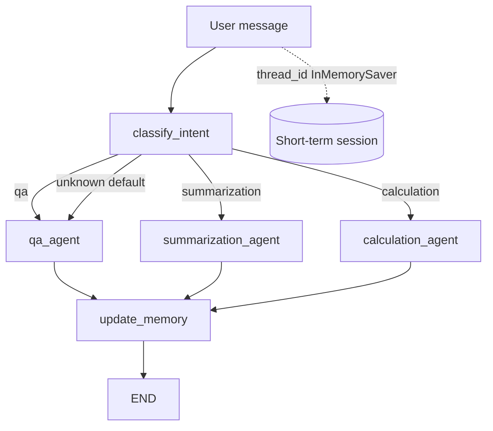

# Document Assistant agent design

## Goal

Route a user request about financial or healthcare documents to the right specialist,
ground the answer in retrieved documents, and keep conversation memory across turns.

## Graph (custom StateGraph)

This is not the course starter `create_react_agent` orchestrator. Routing is explicit.
Specialist nodes may still use a ReAct agent internally so they can call tools.

`classify_intent --> [qa_agent | summarization_agent | calculation_agent] --> update_memory --> END`

## Agents

| Node | Responsibility |
| --- | --- |
| classify_intent | Structured `UserIntent` from user input + history |
| qa_agent | Answer with `AnswerResponse`; search/read documents |
| summarization_agent | `SummarizationResponse`; key points + document IDs |
| calculation_agent | `CalculationResponse`; document reader + calculator |
| update_memory | `UpdateMemoryResponse`; conversation summary + active documents |

## State

`AgentState` carries `user_input`, `messages` (`add_messages` reducer), `intent`,
`next_step`, `conversation_summary`, `active_documents`, `current_response`,
`tools_used`, session ids, and `actions_taken` with an `operator.add` reducer so
node names accumulate for the turn.

## Memory

- **Short-term:** `InMemorySaver` compiled on the workflow. `process_message`
  sets `configurable.thread_id` to `current_session.session_id`, plus `llm` and `tools`.
- **Session files:** JSON under `sessions/` for resume metadata.

## Tools

- `calculator` — validated `eval` of basic arithmetic, logged via `ToolLogger`
- `document_search` — keyword, type, and amount retrieval
- `document_reader` — full document by ID
- `document_statistics` — collection totals
